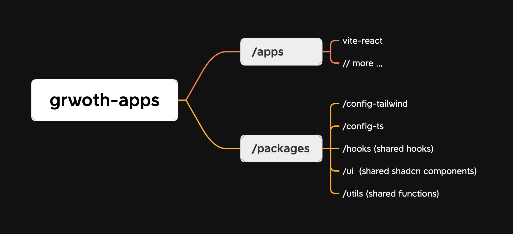

## A monorepo template built using pnpm workspace, utilizing the shadcn component library.



```
├───📁 .vscode/
│   ├───📄 extensions.json
│   └───📄 settings.json
├───📁 apps/
│   └───📁 vite-react/
│       └───...
├───📁 packages/
│   ├───📁 config-tailwind/
│   │   └───...
│   ├───📁 config-ts/
│   │   └───...
│   ├───📁 hooks/
│   │   └───...
│   ├───📁 ui/
│   │   └───...
│   └───📁 utils/
│       └───...
├───📄 .eslintignore
├───📄 .eslintrc.cjs
├───📄 .gitignore
├───📄 .npmrc
├───📄 .prettierignore
├───📄 .prettierrc
├───📄 README.md
├───📄 package.json
├───📄 pnpm-lock.yaml
└───📄 pnpm-workspace.yaml
```
